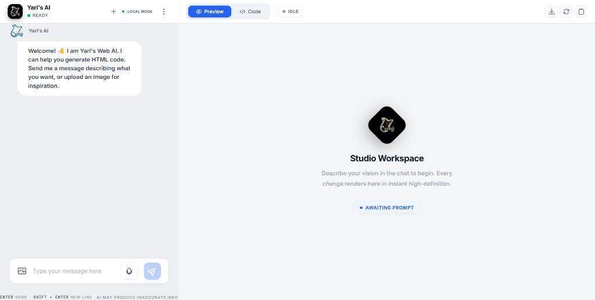
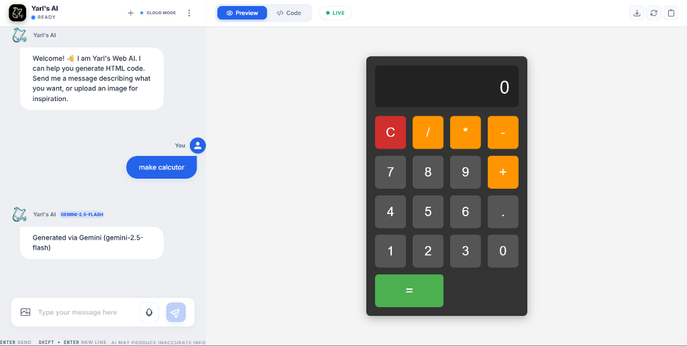
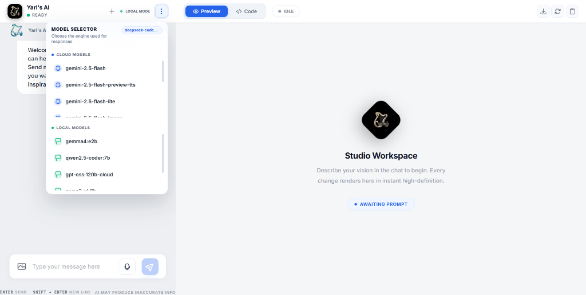
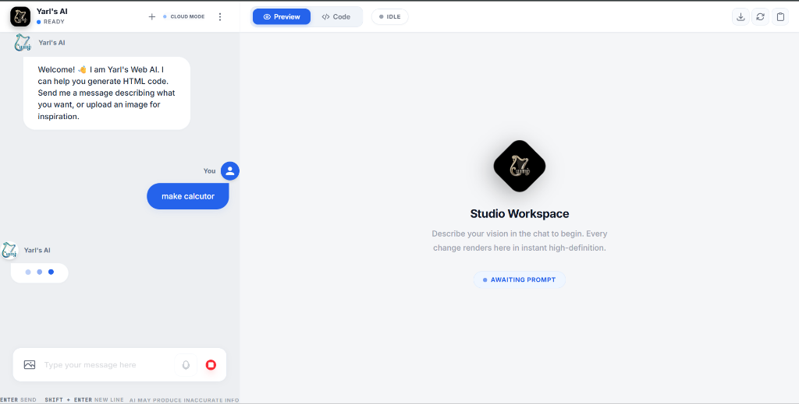
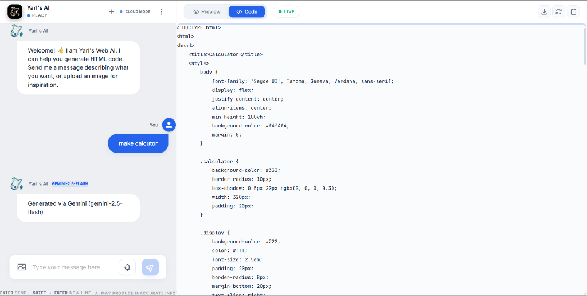
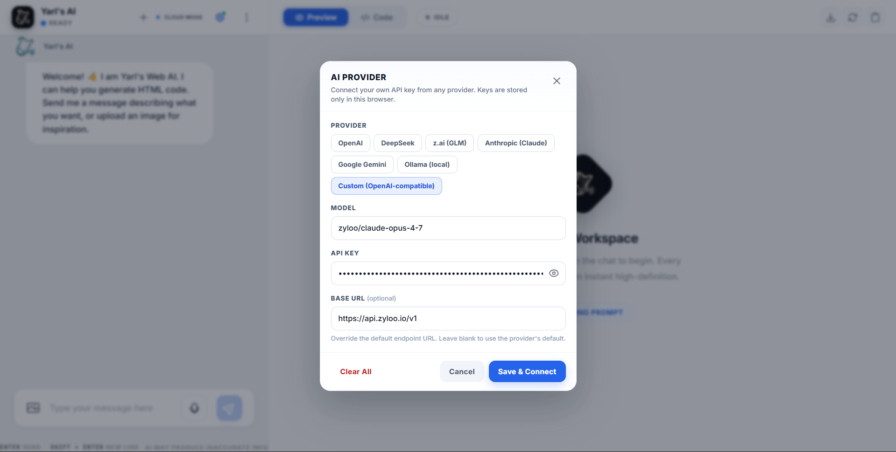
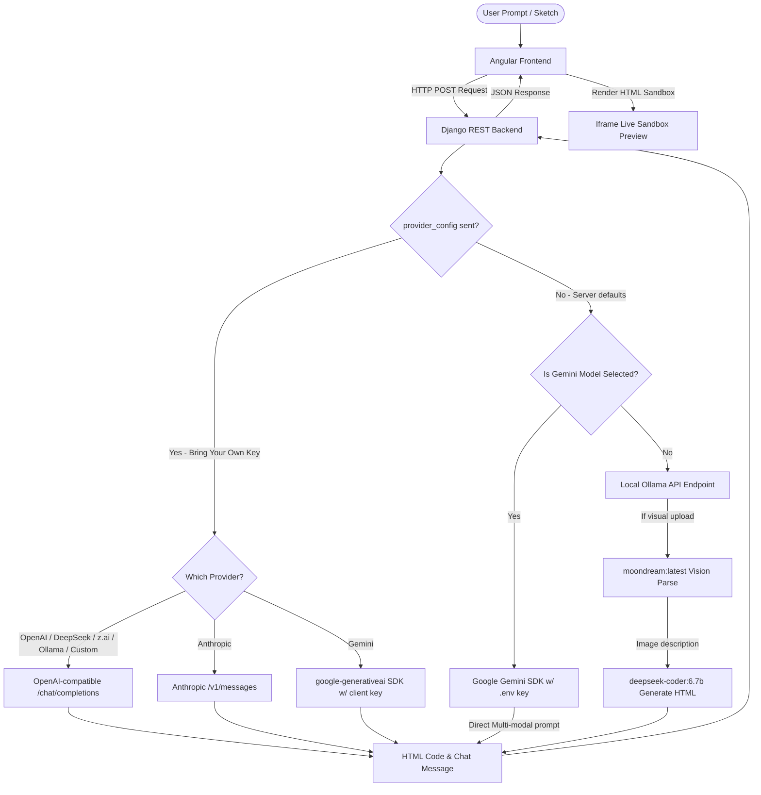

# 🤖 Yarl's Web AI (Yarl's-AI)

[](https://angular.dev/)
[](https://tailwindcss.com/)
[](https://www.djangoproject.com/)
[](https://www.django-rest-framework.org/)
[](https://ollama.com/)
[](https://ai.google.dev/)

Yarl's Web AI is a premium, full-stack website builder and code-generation platform. It allows developers and designers to generate, edit, and preview fully functional responsive HTML/CSS/JS websites instantly from natural language instructions or wireframe mockups. It supports **hybrid LLM backends**, routing prompts to cloud models (Google Gemini, OpenAI, DeepSeek, z.ai, Anthropic Claude) or local models (Ollama) seamlessly.

🔗 **Live Demo:** [Yarl's AI](https://yarl-s-ai.vercel.app/)

---

## 🌟 Key Features

*   **Bring Your Own Key (BYOK)**: Connect your own API key from any provider — **OpenAI, DeepSeek, z.ai (GLM), Anthropic Claude, Google Gemini, Ollama, or any OpenAI-compatible endpoint**. Just click the ⚙️ gear icon in the navbar, pick a provider, paste your key, and the Model Selector instantly lists the models available to that key. Keys are stored only in your browser.
*   **Hybrid Inference Engine**: Choose between high-performance cloud models (Gemini, OpenAI, DeepSeek, Claude) or 100% private offline models (Ollama).
*   **Vision-to-Design**: Upload wireframe wireframes or UI sketches to generate structural code. Local vision uses `moondream:latest` to interpret layouts before generating source code.
*   **Split-Screen Sandbox**: View clean generated code side-by-side with an interactive visual preview panel.
*   **Context-Aware Iterations**: Modify existing applications in real-time. Short feedback loops (e.g. *"make buttons round"*, *"use dark theme"*) modify your existing web code instead of building a new application.
*   **Model Hot-Swapping**: Switch models on the fly using the built-in model manager, or let the model list populate dynamically from your connected provider key.
*   **Docker Containerized**: Run frontend and backend microservices together out of the box using Docker Compose.

---

## 📸 Interface Preview

Here is a visual walkthrough of the Yarl's Web AI workspace.

| Welcome Landing Page | Code & Preview Workspace |
|:---:|:---:|
| <br>*Landing page welcoming user prompt input.* | <br>*Fully generated interactive calculator preview.* |

### 🛠️ Interactive AI Workflow
| 1. Model Selector | 2. Writing Prompt | 3. Source Code Output |
|:---:|:---:|:---:|
| <br>*Switching between Cloud (Gemini) and Local (Ollama) models.* | <br>*Requesting a new component ("make calculator").* | <br>*Instant code generation with custom template bindings.* |

### 🔑 Bring Your Own Key (BYOK)

Connect your own API key from any provider directly from the UI — no `.env` edits required.

| AI Provider Settings | Model Selector with Your Key |
|:---:|:---:|
| <br>*Click the ⚙️ gear icon to connect your own API key from any provider.* | <br>*The Model Selector lists models available to your connected key.* |

**How to use it:**

1. Click the **⚙️ gear icon** in the chat navbar (next to the 3-dots model selector).
2. Pick a provider chip in the **AI Provider** modal:
   *   **OpenAI** — `gpt-4o-mini` · `https://api.openai.com/v1`
   *   **DeepSeek** — `deepseek-chat` · `https://api.deepseek.com/v1`
   *   **z.ai (GLM)** — `glm-4.6` · `https://api.z.ai/api/paas/v4`
   *   **Anthropic (Claude)** — `claude-3-5-sonnet-latest` · `https://api.anthropic.com`
   *   **Google Gemini** — `gemini-1.5-flash` (uses the Gemini SDK)
   *   **Ollama (local)** — `deepseek-coder:6.7b` · `http://127.0.0.1:11434/v1`
   *   **Custom** — any OpenAI-compatible endpoint + your model name
3. Enter your **API key** (optionally adjust the model name / base URL).
4. Click **Save & Connect**. The ⚙️ icon shows a green dot, and the **⋮ Model Selector** now lists the models available to your key.

> **Security:** Your key is stored only in your browser's `localStorage` and sent with each request. The backend uses it *instead of* the server-side `.env` key. Click **Clear All** in the modal to remove it.

---

## 📂 Project Directory Structure

```text
Yarl's-AI/
├── backend/                  # Django REST API Backend
│   ├── api/                  # Django App (Views, Endpoints, Router)
│   │   ├── views.py          # Multi-provider routing: BYOK + Gemini & Ollama defaults
│   │   ├── urls.py           # API routes (/generate/, /stop/, /models/)
│   │   └── tests.py          # API automated test scripts
│   ├── config/               # Django Main Config (settings.py, urls.py)
│   ├── requirements.txt      # Python dependencies (Django 6, Gemini, gunicorn)
│   ├── Dockerfile            # Container config for backend service
│   └── manage.py             # Django entrypoint script
├── front-end/                # Angular Frontend Client
│   ├── src/
│   │   ├── app/              # Angular Core Module
│   │   │   ├── components/   # UI Layouts (chat-panel w/ BYOK modal, preview-panel)
│   │   │   ├── services/     # api.service.ts (chat, stop, models + provider models)
│   │   │   ├── app.ts        # Main app component script
│   │   │   └── app.html      # Main app component template layout
│   │   ├── styles.css        # Global custom styling rules
│   │   └── main.ts           # App startup config
│   ├── package.json          # Frontend packages & Angular build scripts
│   ├── Dockerfile            # Nginx deployment server container config
│   └── nginx.conf            # Custom proxy settings for Production build
├── screenshots/              # Git screenshots (image1.png to image7.png)
├── docker-compose.yml        # Orchestration file for full stack
├── .env                      # Global environment variable configuration
└── README.md                 # Project Documentation
```

---

## ⚙️ Prerequisites & Installation

### Option 1: Quick Start with Docker (Recommended)

To run the entire system (Frontend + Backend) inside Docker containers:

1. Clone this repository and navigate to the directory:
   ```bash
   git clone https://github.com/your-username/yarls-ai.git
   cd Yarl's-AI
   ```
2. Configure your environment variables in `.env` (see Environment Configuration section below).
3. Build and launch the containers:
   ```bash
   docker-compose up --build
   ```
4. Access the application:
   *   **Frontend Client**: `http://localhost:4200`
   *   **Backend Server API**: `http://localhost:8000/api/`

---

### Option 2: Running Locally for Development

#### 1. Backend Setup (Django REST Framework)
1. Navigate to the backend folder:
   ```bash
   cd backend
   ```
2. Create a virtual environment and activate it:
   ```bash
   python -m venv venv
   # On Windows:
   venv\Scripts\activate
   # On macOS/Linux:
   source venv/bin/activate
   ```
3. Install the dependencies:
   ```bash
   pip install -r requirements.txt
   ```
4. Run standard database migrations:
   ```bash
   python manage.py migrate
   ```
5. Spin up the development server:
   ```bash
   python manage.py runserver
   ```
   The backend server will run on `http://127.0.0.1:8000`.

#### 2. Frontend Setup (Angular)
1. Open a new terminal and navigate to the frontend folder:
   ```bash
   cd front-end
   ```
2. Install npm dependencies:
   ```bash
   npm install
   ```
3. Start the Angular dev server:
   ```bash
   npm run start
   ```
   The frontend UI will run on `http://localhost:4200`.

---

## 🧠 LLM Engine Setup

Yarl's-AI supports two ways to power AI generation: **bring your own key** (recommended) or **server-side defaults** (Gemini/Ollama via `.env`).

### 🔑 Option A: Bring Your Own Key (Recommended)

The fastest way to get started — no `.env` keys or local model installs required. See the [🔑 Bring Your Own Key (BYOK)](#-bring-your-own-key-byok) section above for the full step-by-step guide and the list of supported providers (OpenAI, DeepSeek, z.ai, Anthropic, Gemini, Ollama, Custom).

### 🌐 Option B: Cloud Engine — Google Gemini (server-side `.env`)

To run cloud models like `gemini-2.5-flash` or `gemini-1.5-pro` using the server's own key:
1. Obtain an API key from [Google AI Studio](https://aistudio.google.com/app/apikey).
2. Open the `.env` file in the project root and add your key:
   ```env
   GEMINI_API_KEY=your_actual_gemini_api_key_here
   ```

### 💻 Local Engine: Ollama

To run models locally offline:
1. Download and install [Ollama](https://ollama.com/).
2. Start the Ollama server:
   ```bash
   ollama serve
   ```
3. Pull the recommended code generation and vision models:
   ```bash
   # Code Generation model (DeepSeek-Coder)
   ollama pull deepseek-coder:6.7b

   # Vision model (Moondream for layout extraction)
   ollama pull moondream:latest

   # Optional alternative coding model
   ollama pull qwen2.5-coder:7b
   ```
4. Confirm your local models are ready:
   ```bash
   ollama list
   ```

---

## 🔒 Environment Configuration (`.env`)

Create a `.env` file in the root folder. Below is a production-ready template:

```env
# Google Gemini API key
GEMINI_API_KEY=AIzaSy...

# Django Web App configurations
DJANGO_SECRET_KEY=generate-a-long-secure-random-key-here
DJANGO_DEBUG=True
DJANGO_ALLOWED_HOSTS=127.0.0.1,localhost,localhost:4200

# CORS policies
CORS_ALLOW_ALL_ORIGINS=True

# Base URL to Ollama endpoint (For docker, use host.docker.internal to bridge host ports)
OLLAMA_BASE_URL=http://host.docker.internal:11434
```

---

## 🧑‍💻 Technical Workflow Description


---

## 🤝 Contribution Guidelines

Contributions are welcome! Please follow these steps to contribute:
1. Fork the Project.
2. Create your Feature Branch (`git checkout -b feature/AmazingFeature`).
3. Commit your Changes (`git commit -m 'Add some AmazingFeature'`).
4. Push to the Branch (`git push origin feature/AmazingFeature`).
5. Open a Pull Request.

---

## 📄 License

Distributed under the MIT License. See `LICENSE` for more information.
